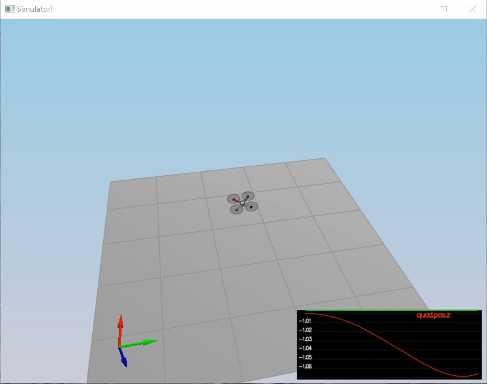
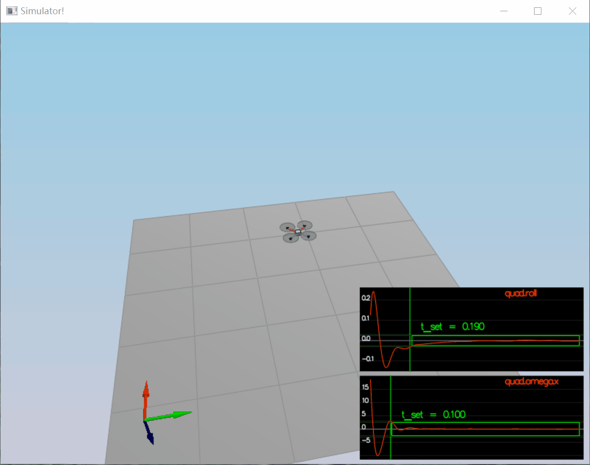
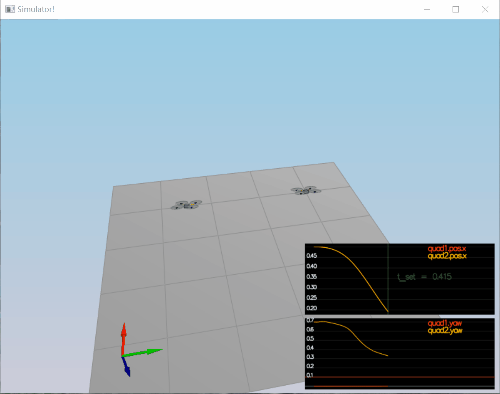
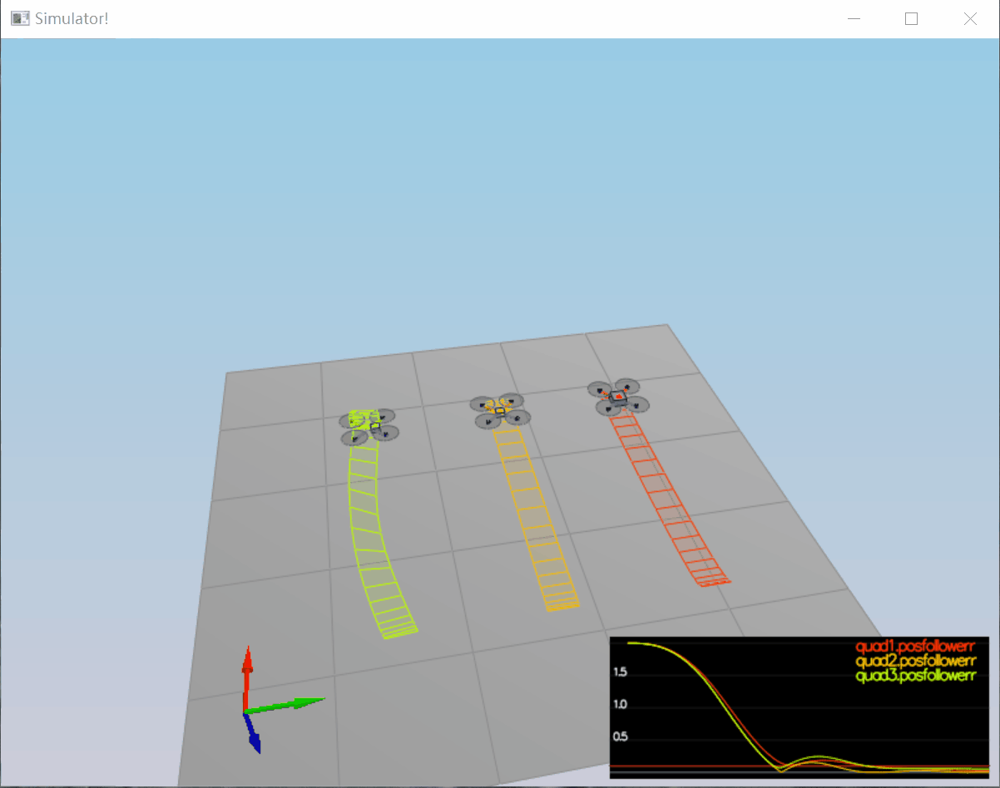

# Project: Control of a 3D Quadrotor #
This is one of my Udacity Nanodegree project of Flying cars.

Here are the contents of this project:
- Implemented controllers/functions through Scenario 1~5
- Evaluation

## Scenario 1 ##
Simply tuning of the quadrotor's 'Mass' parameter to 0.5 to let it hover.

## Scenario2 ##
In this scenario, after implementing the following functions and tuning `kpPQR` and `kpBank`, the quadrotor is able to gradually level itself up without flipping. The roll angle error and body rate omega error get controlled to 0.

Note this Scenario CANNOT be fully completed unless `AltitudeControl()`is implemented. I think the original problem decription did not take this into consideration.

### 1. Imelemented functions:`GenerateMotorCommands()` ###

A collective thrust and total moments are given here so the goal is to compute thrust for each propeller by solving the following linear equations.

`f1 + f2 + f3 + f4 = collThrustCmd`

`f1 - f2 + f3 - f4 = mementCmd.x / l `

`f1 - f2 - f3 + f4 = -momentCmd.z / kappa`

`f1 + f2 - f3 - f4 = momentCmd.y / l`

### 2. Imelemented functions:`BodyRateControl()` ###

A proportional P controller is implemented to compute desired moment when given current body rate.

### 3. Imelemented functions:`RollPitchControl()` ###

A P controller is implemented to compute a desired pitch and roll angle given a desired global acceleration, the current attitude of the quad and the collective thrust.

## Scenario3 ##
In this scenario, position, altitude and yaw control are implemented. Two quads with different yaw rate are controlled to fly to the target position with the same final pose and the tracking error of both go down. The parameters tuned to achieve this are: `kpPosZ`, `kiPosZ`, `kpVelXY`,  `kpVelZ` and `kpYaw`.

### 1. Imelemented functions:`LateralPositionControl()` ###

A PD controller to compute a desired horizontal acceleration based on given desired lateral position/velocity and current acceleration.

### 2. Imelemented functions:`AltitudeControl()` ###
A PID controller to compute the desired quad thrust based on desired and current altitude/velocity/pose. An integrator is also implemented to control mass non-idealities presented in Scenario4.

### 3. Imelemented functions:`YawControl()` ###
A P controller to compute a yaw rate when given a desired and current yaw rate.

## Scenario4 ##
In this scenario, there are 3 different quads flying the same route, 2 of which are non-ideal drones. After re-tuning the parameters and implementing an integrator, they are able to fly to the target place with error close to zero.

### 1. Imelemented functions:`AltitudeControl()` ###
Add an integrator to it so that past error is taken into account.

## Scenario5 ##
In this scenario, there are 2 drone flying 2 trajectories, where in one of which the velocity trajectory is provided.
The parameters are re-tuned to pass the test.

Since the orange one follows the trajectory without velocity given, it seems harder to fly properly. Currently the optional challenges are not included in this project.

## Evaluation ##
All scenarios passed the evaluation. When running each scenario, a `PASS`  shows on command line and a **green box** shows on the graph of Simulator window.
